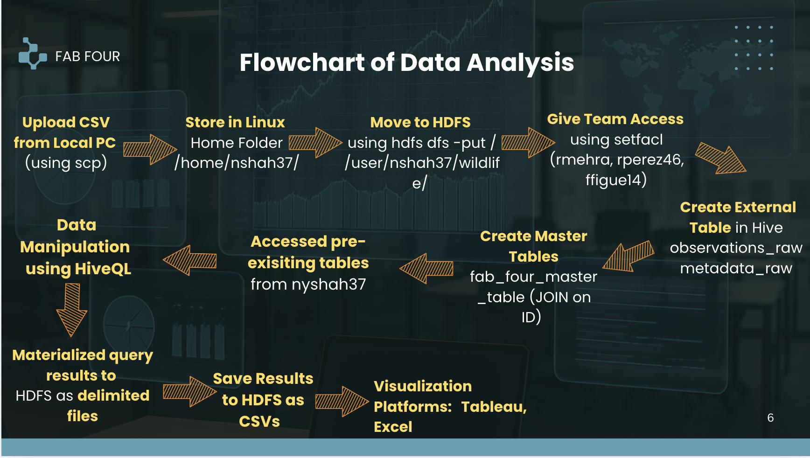
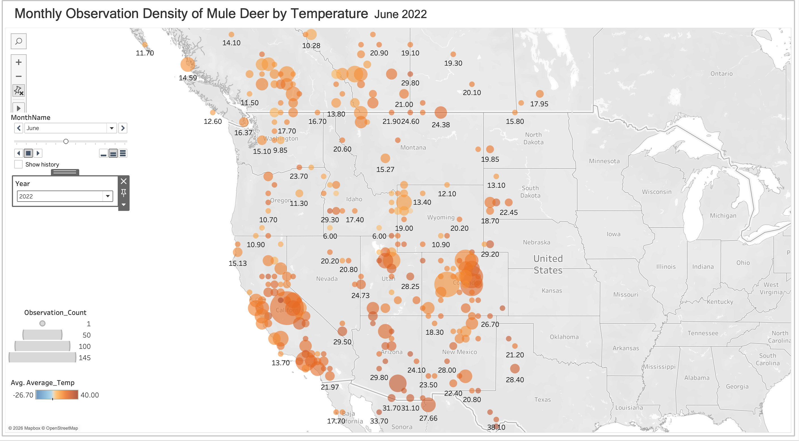
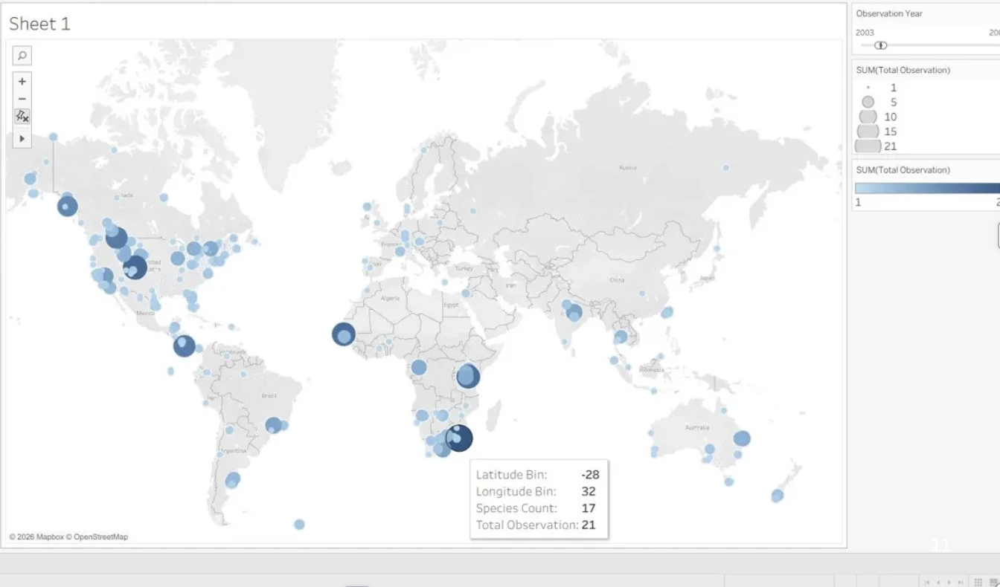

# Spatiotemporal Wildlife Activity Analysis

## Objectives 

This project we analyzed a large scale spatiotemporal wildlife dataset using Hive to identify patterns in wildlife behavior across time and geographic locations.

## Dataset Overview and Preparation

## Dataset Overview (Kaggle / iNaturalist Source)

This project is based on a subset of the **iNaturalist open observations dataset**, distributed via Kaggle. iNaturalist is a global citizen‑science platform where users contribute georeferenced observations of living organisms.

 The full iNaturalist dataset contains **hundreds of millions of observations** collected worldwide.
- Observations span **hundreds of thousands of species**, covering:
  - Plants
  - Mammals
  - Birds
  - Reptiles
  - Amphibians
  - Insects and other invertebrates
- Species are organized hierarchically across standard taxonomic levels:
  - Kingdom → Phylum → Class → Order → Family → Genus → Species

### Original Datasets

- **Observations dataset**
  - Contained individual species observation records.
  - Key features included:
    - Observation ID
    - Scientific name and common name
    - Observation date
    - Geographic coordinates (latitude, longitude)
  - Represented *where* and *when* species were observed.

- **Metadata dataset**
  - Contained environmental and contextual information linked to observations.
  - Key features included:
    - Temperature at time of observation (`temperature_2m`)
    - Elevation
    - Observation hour
  - Linked to observations using a shared `id` field.

---

## Research Questions

- Radhika : Does average monthly temperature influence where species are observed differently across regions?
- Roberto : Does the rarity of species observations vary systematically across space and time?
- Niyati : Do observation hotspots persist, disappear, or shift over time?
- Fatima : Are species observed at different times of day?

## Methods and FlowChart of Analysis

### Final Master Table (`fab_four_master_table`)

The master table represents the **cleaned, integrated dataset** used for all analysis and visualization.

**Columns retained in the master table:**

- `id` – Unique observation identifier
- `scientific_name` – Scientific species name
- `common_name` – Common species name
- `latitude` – Geographic latitude of observation
- `longitude` – Geographic longitude of observation
- `observed_on` – Observation date (stored as string)
- `temperature_2m` – Temperature at time of observation (meters above ground)
- `obs_hour` – Hour of observation
- `elevation` – Elevation at observation site

---

### Purpose of the Master Table

- Provides a **single source of truth** for all analyses.
- Eliminates the need for repeated joins between raw tables.
- Supports:
  - Spatial density mapping
  - Temporal trend analysis
  - Temperature–observation relationships
  - Time‑of‑day patterns in species observations

All subsequent views and exported datasets are derived directly from this master table

## Visualization

Radhika : Does average monthly temperature influence where species are observed differently across regions?

- Niyati : Do observation hotspots persist, disappear, or shift over time?

 
  
- Fatima : Are species observed at different times of day?

