# Does Monthly Temperature alter the movement of the Mule Deer ? 

This document describes the complete Hive-based workflow used to explore,prepare, and aggregate wildlife observation data for visualization. The purpose of this visualization is to show the spatial redistribution of the Odocoileus hemionus ( Mule deer) species for the with average monthly temperature changes from 2020-2022 across the United States. The final deliverable is a Symbol Map in Tableau, animating time, temperature and density variables, which serves more as a visualization tool than a static visualization.

---

## Step 0: Exploratory Species Analysis in Hive

This step identifies suitable species for analysis based on observation
volume and temporal coverage using pre-existing Hive tables.

---

### 0.1 Set the Active Hive Database

All analysis was performed using tables from the shared `nshah37` database.

```sql
USE nshah37;
```
---

### 0.2 Identify Species with the Highest Number of Observations

This query ranks species by total observation count to ensure sufficient data density for spatial aggregation.

```sql
 SELECT
  scientific_name,
  COUNT(*) AS observation_count
FROM fab_four_master_table
WHERE scientific_name RLIKE '[A-Za-z]'
GROUP BY scientific_name
ORDER BY observation_count DESC
LIMIT 10;
```

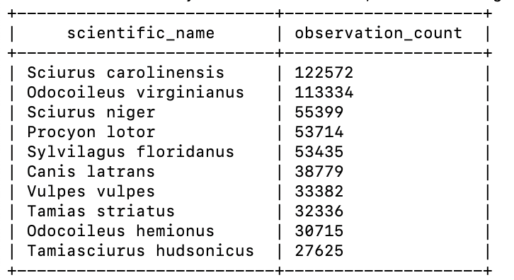


---

### 0.3 Identify Species with the Greatest Temporal Coverage

```sql
SELECT
  scientific_name,
  COUNT(DISTINCT YEAR(CAST(observed_on AS DATE))) AS num_years
FROM fab_four_master_table
WHERE scientific_name RLIKE '[A-Za-z]'
GROUP BY scientific_name
ORDER BY num_years DESC
LIMIT 30;
```
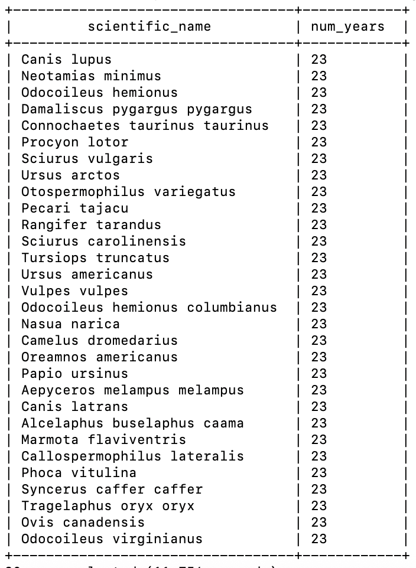
---

### 0.4 Species Selection

Species appearing in both the high observation-count and high temporal-coverage rankings were considered suitable for analysis. Mule deer (Odocoileus hemionus) satisfies both criteria and was selected for downstream processing.

### 0.5 : Year Selection 

```sql
SELECT
  YEAR(CAST(observed_on AS DATE)) AS year,
  COUNT(*) AS total_observations,
  COUNT(temperature_2m) AS temp_available
FROM fab_four_master_table
WHERE scientific_name = 'Odocoileus hemionus'
  AND scientific_name RLIKE '[A-Za-z]'
GROUP BY YEAR(CAST(observed_on AS DATE))
ORDER BY year;
```

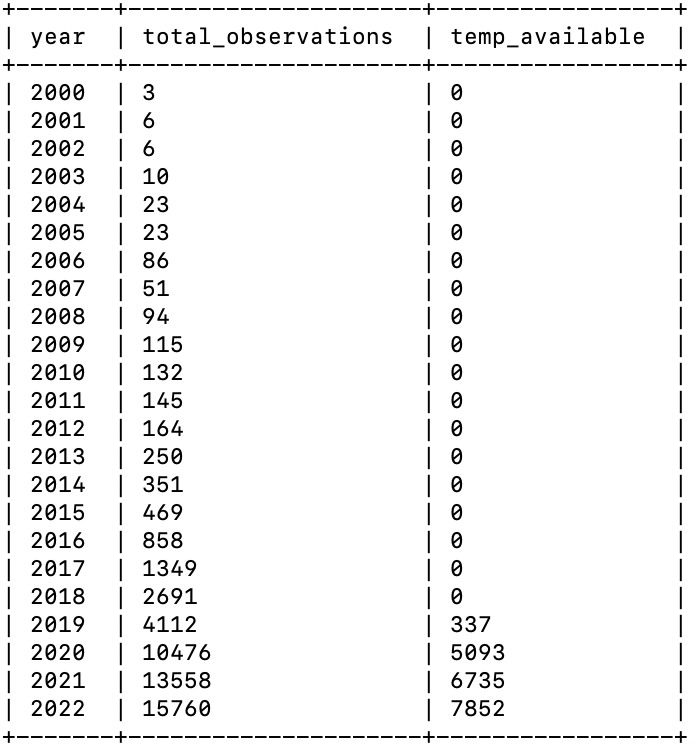

Here 2020-2022 emerges as the years with maximum observations for this species and hence, would be used.

---

## Step 1 : Visualization Code

### Step 1.1: Create a Clean Base View for Analysis - odocoileus_base

This base creates a one row record for each observation of the species of Mule deer, extracting year and month for each observation and limiting outcomes to year for 2020-2022 for non-null values. 

```sql
CREATE OR REPLACE VIEW odocoileus_base AS
SELECT
  id,
  latitude,
  longitude,
  YEAR(FROM_UNIXTIME(UNIX_TIMESTAMP(observed_on, 'yyyy-MM-dd'))) AS year,
  MONTH(FROM_UNIXTIME(UNIX_TIMESTAMP(observed_on, 'yyyy-MM-dd'))) AS month,
  temperature_2m
FROM fab_four_master_table
WHERE scientific_name = 'Odocoileus hemionus'
  AND latitude IS NOT NULL
  AND longitude IS NOT NULL
  AND temperature_2m IS NOT NULL
  AND YEAR(FROM_UNIXTIME(UNIX_TIMESTAMP(observed_on, 'yyyy-MM-dd'))) BETWEEN 2020 AND 2022;
```
---
### Check the format of odocoileus_base

```sql
SELECT *
FROM odocoileus_base
LIMIT 10;
```
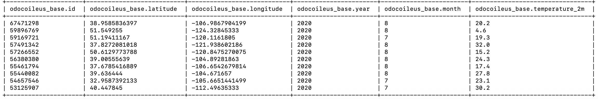
---

### Step 1.2 : Aggregate Observations into Spatial Density Grids

This step converts point-level observations into spatial grid cells to enable density-based visualization, along with aggregating count of observations and average temperature. This view builds on the odocoileus_base, and converts geography into spatial units so as to see easier patterns for density. 

```sql
CREATE OR REPLACE VIEW odocoileus_density_grid AS
SELECT
  ROUND(latitude * 2) / 2  AS lat_cell,
  ROUND(longitude * 2) / 2 AS lon_cell,
  year,
  month,
  COUNT(*) AS observation_count,
  AVG(temperature_2m) AS avg_temperature
FROM odocoileus_base
GROUP BY
  ROUND(latitude * 2) / 2,
  ROUND(longitude * 2) / 2,
  year,
  month;
```
### Check the format of odocoileus_density_grid

```
SELECT *
FROM odocoileus_density_grid
LIMIT 10;
```
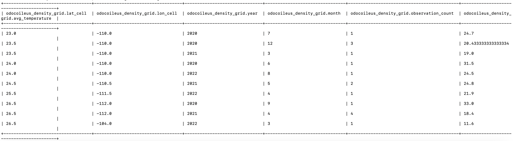

---

### Step 1.3 : Add Readable Month Labels

This step improves interpretability for visualization tools by adding human-readable month names.

```sql
CREATE OR REPLACE VIEW odocoileus_density_grid_named AS
SELECT
  lat_cell,
  lon_cell,
  year,
  month,
  CASE
	WHEN month = 1  THEN 'January'
	WHEN month = 2  THEN 'February'
	WHEN month = 3  THEN 'March'
	WHEN month = 4  THEN 'April'
	WHEN month = 5  THEN 'May'
	WHEN month = 6  THEN 'June'
	WHEN month = 7  THEN 'July'
	WHEN month = 8  THEN 'August'
	WHEN month = 9  THEN 'September'
	WHEN month = 10 THEN 'October'
	WHEN month = 11 THEN 'November'
	WHEN month = 12 THEN 'December'
  END AS month_name,
  observation_count,
  avg_temperature
FROM odocoileus_density_grid;
```

### Check the format of odocoileus_density_grid_named

```sql
SELECT *
FROM odocoileus_density_grid_named
LIMIT 10;
```
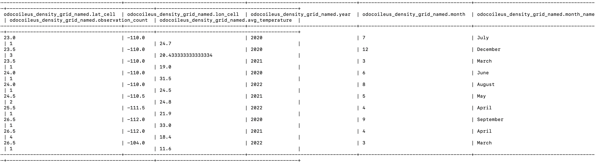
---

### Step 1.4 : Export Aggregated Dataset to HDFS

```sql
INSERT OVERWRITE DIRECTORY '/user/rmehra/odocoileus_density_map'
ROW FORMAT DELIMITED
FIELDS TERMINATED BY ','
SELECT
  lat_cell,
  lon_cell,
  year,
  month,
  month_name,
  observation_count,
  avg_temperature
FROM odocoileus_density_grid_named;
```
### Step 2 : copy the query files to into my linux home directory, rmehra : 

```
hdfs dfs -get /user/rmehra/odocoileus_density_map ~/odocoileus_density_map

```
---

### Step 3 : To combine all of the views using cat statement into one csv

```
cat ~/odocoileus_density_map/* > ~/odocoileus_density_map.csv
```
---

### Step 4: To confirm that odocoileus_density_map in rmehra

```
ls -lh ~/odocoileus_density_map.csv
```
---

### Step 5 : Downloaded the csv to my mac computer :

```
scp rmehra@132.226.148.236:/home/rmehra/odocoileus_density_map.csv .
```
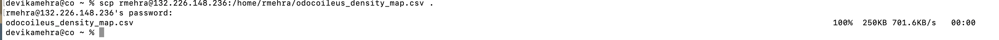

## Step 6 : Tableau Visualization in a Symbol Map

- After organizing the final aggregated dataset into a single CSV file, the data was imported into Tableau using the **Text File** connection option.

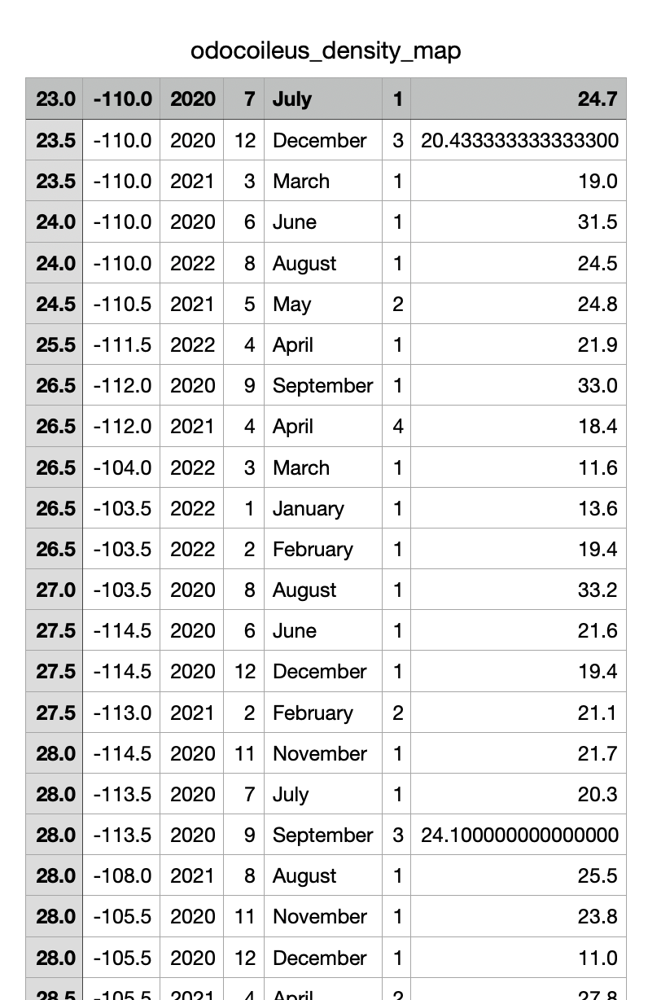


- Within Tableau, appropriate data types and geographic roles were assigned to each column to ensure correct visualization behavior:
  - **Longitude** — Geographic Role: Longitude
  - **Latitude** — Geographic Role: Latitude
  - **Year** — Whole Number
  - **Month** — Whole Number
  - **MonthName** — String
  - **Observation_Count** — Whole Number
  - **Average_Temp** — Number (Decimal)
``

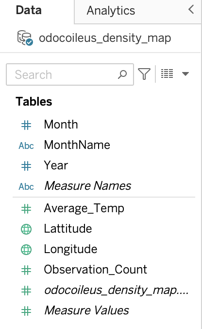

### Tableau Visualization Construction

   - **Latitude** was dragged to the **Rows** shelf
   - **Longitude** to the **Columns** shelf to create the base map.
   - **MonthName** was placed on the **Pages** shelf to serve as a time slider for month‑by‑month temporal analysis.
   - **Year** was added as a **Filter** and configured as a **Single Value (Dropdown)** to allow flexible and fine‑grained year selection.
   - **AVG(Average_Temp)** was assigned to the **Marks → Color** shelf, with the color range manually adjusted (−27.90 to 41.50) to ensure the color gradient accurately represents temperature variation.
   - **SUM(Observation_Count)** was placed on the **Marks → Size** shelf so that marker size reflects monthly observation density.
   - The **visualization title** was customized to dynamically update based on the selected month and year, providing clear temporal context.
  - **Marks → Label** and **Marks → Detail** were used to display additional information when hovering over individual map points.
  - The visualization was converted into a **Dashboard**, with **floating legends** and layout adjustments applied to achieve a clean, professional presentation.


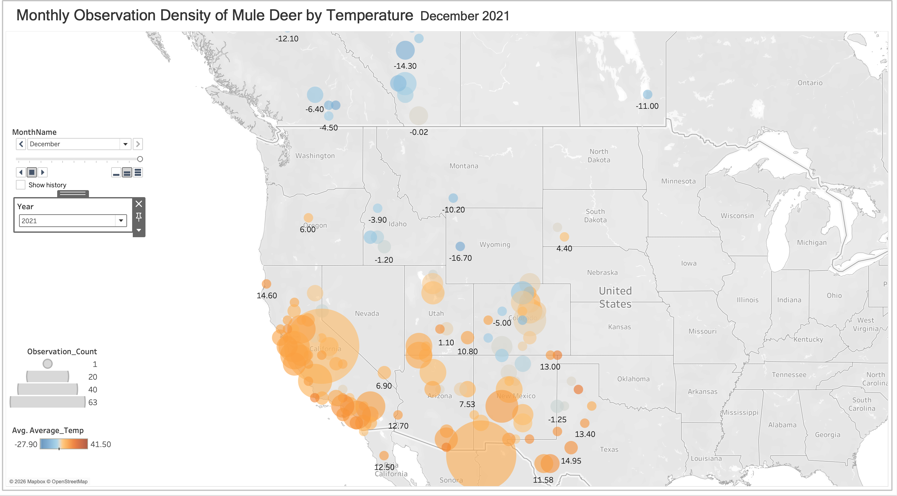

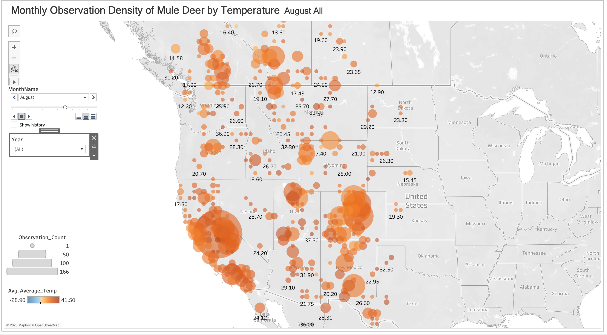


